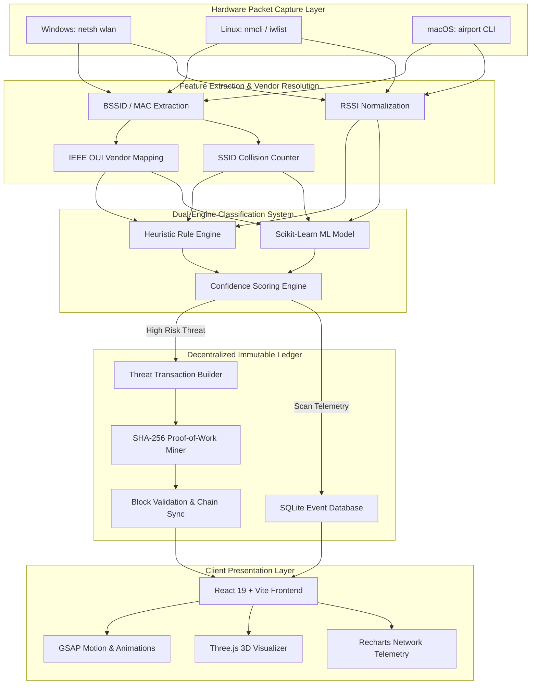
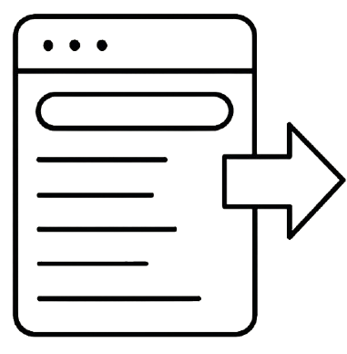
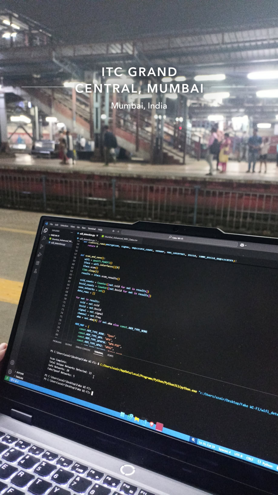
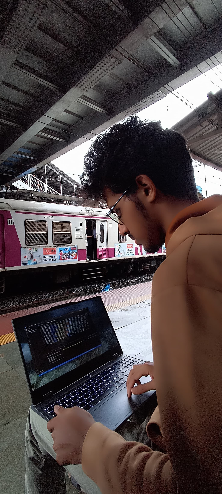
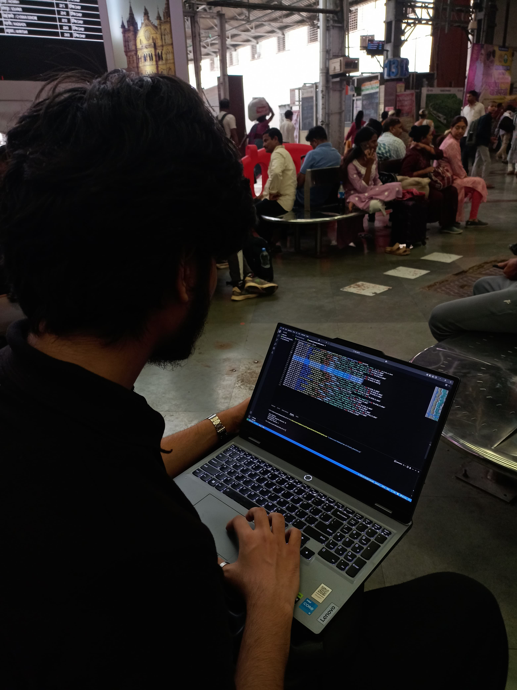
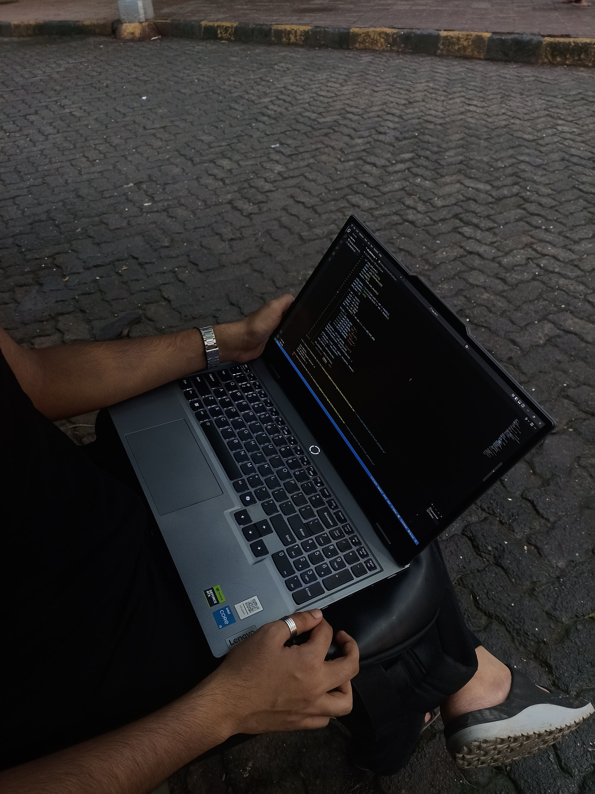
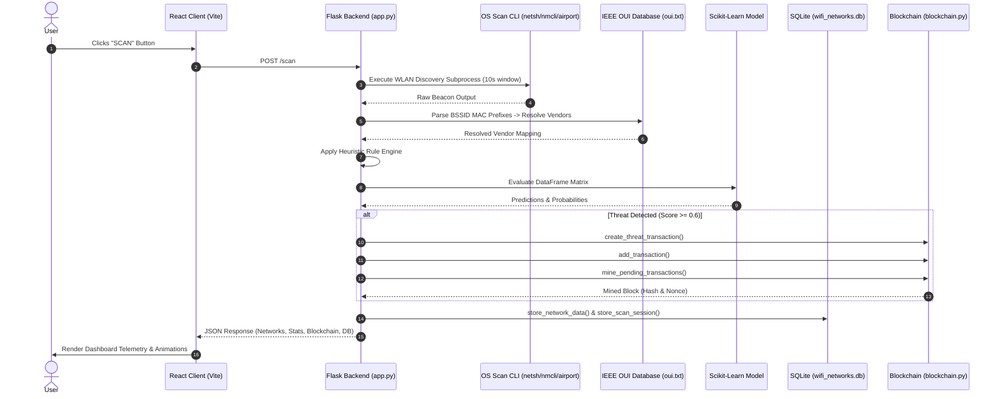

<div align="center">

  <h1>WIChain</h1>
  <p><strong>Decentralized Real-Time Wi-Fi Threat Intelligence & Evil Twin Prevention Engine</strong></p>

  <p>
    <a href="https://python.org"></a>
    <a href="https://react.dev"></a>
    <a href="https://flask.palletsprojects.com"></a>
    <a href="https://scikit-learn.org"></a>
    <a href="https://vitejs.dev"></a>
    <a href="https://tailwindcss.com"></a>
    <a href="https://sqlite.org"></a>
    <a href="https://opensource.org/licenses/MIT"></a>
  </p>

  <p>
    
    
    
    
  </p>

</div>

---

## Executive Summary

**WIChain** is a zero-trust, cross-platform Wi-Fi threat detection and decentralized ledger platform engineered to identify zero-day Wi-Fi spoofing, Rogue Access Points (RAPs), and Evil Twin attacks in real time. 

By unifying **OS-level raw beacon frame parsing**, a **Scikit-Learn machine learning classification pipeline**, **IEEE OUI hardware vendor validation**, and an **immutable Proof-of-Work (PoW) blockchain ledger**, WIChain ensures that network anomalies are detected within milliseconds and recorded permanently on a tamper-proof chain for forensic auditing.

```
+------------------+     +------------------------+     +-------------------------+     +------------------------+
| OS WLAN Scanning | --> | Heuristic Rule Engine  | --> | Machine Learning Model  | --> | Proof-of-Work Ledger   |
| (netsh/nmcli/air)|     | & IEEE OUI Vendor Lookup|     | (RandomForest Pipeline) |     | (SHA-256 Block Mining) |
+------------------+     +------------------------+     +-------------------------+     +------------------------+
                                                                                                     |
                                                                                                     v
                                                                                        +------------------------+
                                                                                        |  React Visual Dashboard|
                                                                                        |  (GSAP / Three.js)     |
                                                                                        +------------------------+
```

---

## Table of Contents

- [Executive Summary](#executive-summary)
- [Problem Statement & Ground Research](#problem-statement--ground-research)
- [System Architecture](#system-architecture)
- [Core Features & Capabilities](#core-features--capabilities)
- [Visual Showcase & UI Screenshots](#visual-showcase--ui-screenshots)
- [Technology Stack Matrix](#technology-stack-matrix)
- [Machine Learning & Threat Classification Engine](#machine-learning--threat-classification-engine)
- [Decentralized Blockchain Ledger Specification](#decentralized-blockchain-ledger-specification)
- [System Workflows & Data Pipelines](#system-workflows--data-pipelines)
- [Repository & Folder Structure](#repository--folder-structure)
- [Installation & Prerequisites](#installation--prerequisites)
- [Environment Variables](#environment-variables)
- [Operating System Specific Setup Guide](#operating-system-specific-setup-guide)
- [REST API Endpoint Reference](#rest-api-endpoint-reference)
- [Engineering Decisions & Technical Trade-Offs](#engineering-decisions--technical-trade-offs)
- [Performance Benchmarks & Optimizations](#performance-benchmarks--optimizations)
- [Security Model & Safeguards](#security-model--safeguards)
- [Engineering Challenges Solved](#engineering-challenges-solved)
- [Future Engineering Roadmap](#future-engineering-roadmap)
- [Frequently Asked Questions (FAQ)](#frequently-asked-questions-faq)
- [Troubleshooting & Diagnostics](#troubleshooting--diagnostics)
- [Contribution Guidelines](#contribution-guidelines)
- [License & Terms](#license--terms)
- [Authors & Acknowledgements](#authors--acknowledgements)

---

## Problem Statement & Ground Research

### The Real-World Vulnerability

Wireless networks operating in high-density public hubs (airports, railway stations, coffee shops, urban centers) present a severe vector for **Evil Twin attacks**. Attackers configure Rogue Access Points (RAPs) broadcasting cloned Service Set Identifiers (SSIDs) with elevated transmit power (RSSI). Unsuspecting client devices automatically connect to the stronger malicious AP, allowing attackers to execute Man-in-the-Middle (MitM) packet interception, SSL stripping, credential harvesting, and session hijacking.

Traditional network intrusion detection systems (NIDS) fail at the edge because:
1. They require expensive, specialized monitoring hardware (RF spectrum analyzers, dedicated air-monitors).
2. Existing detection databases rely on centralized cloud servers vulnerable to single-point tampering or log deletion.
3. Conventional rule checks miss subtle multi-AP anomalies and MAC address spoofing.

### Empirical Ground Research Field Study

To ground WIChain in real-world network conditions, an empirical field study was conducted across high-density nodes of the **Mumbai Metropolitan Railway Network**. Using mobile scanning nodes, Wi-Fi environment signatures were logged across multiple high-traffic transit terminals:

| Research Location | Logged Access Points | Observed Network Anomalies & Characteristics |
| :--- | :---: | :--- |
| **Dadar Station** | 42 | High network density; severe SSID collisions; commercial hotspot overlaps. |
| **Thane Station** | 35 | Consistent signal levels; prevalence of unencrypted (Open) public networks. |
| **Kurla Station** | 28 | **Active Rogue AP Detection**: Identified spoofed SSIDs mimicking official station Wi-Fi. |
| **Vashi Station** | 31 | Suburban environment; intermittent signal degradation; anomalous OUI vendor signatures. |

This dataset enabled the training of machine learning classifiers capable of distinguishing legitimate multi-AP enterprise deployments from malicious clone networks.

---

## System Architecture

WIChain implements a 5-tier decoupled architecture separating hardware packet discovery, heuristic evaluation, predictive machine learning inference, cryptographic consensus storage, and client dashboard visualization.



---

## Core Features & Capabilities

### 1. Cross-Platform Native Wi-Fi Packet Discovery
- Executes non-destructive, native system API scans across Windows (`netsh`), Linux (`nmcli`), and macOS (`airport`).
- Extracts SSIDs, BSSIDs (MAC addresses), RSSI (dBm), Encryption Standards (WPA2, WPA3, WEP, Open), and Frequency Bands (2.4GHz / 5GHz).
- Operates entirely in user-space without requiring external RF dongles or monitor-mode network interface cards.

### 2. IEEE OUI Hardware Vendor Verification
- Integrates a local database (`oui.txt`) containing over **700,000 bytes of IEEE Organizationally Unique Identifiers**.
- Performs instant OUI lookup against BSSID MAC prefixes (e.g., `00:11:22` -> `Cisco`, `Apple`, `Netgear`, `TP-Link`).
- Flags access points presenting spoofed MAC addresses or unregistered manufacturer OUIs.

### 3. Dual-Layer Threat Detection Engine
- **Heuristic Rule Engine**: Analyzes weak encryption protocols (Open/WEP), duplicate SSID broadcasting, suspicious SSID naming conventions ("Free_Public_WiFi"), missing internet connectivity, and anomalous strong signals (> -30 dBm) from unverified vendors.
- **Machine Learning Classification**: Evaluates a multi-dimensional feature matrix (`SSID`, `RSSI`, `Encryption`, `Band`, `Duplicate_Count`, `Vendors`, `Internet_Access`) using a trained `scikit-learn` pipeline.

### 4. Custom SHA-256 Proof-of-Work Blockchain Ledger
- Implements an autonomous blockchain (`backend/blockchain.py`) to cryptographically seal high-risk threat events.
- Employs Proof-of-Work (PoW) consensus with dynamic target difficulty (default: 3 leading zeros).
- Prevents history alteration via cryptographic block linking (`previous_hash` digest).
- Includes automatic block mining upon threat threshold breach and manual mining endpoints (`/mine-block`).

### 5. High-Performance Interactive Dashboard
- Built with **React 19**, **Vite 7**, and **Tailwind CSS v4**.
- Cinematic visual effects powered by **GSAP**, **Framer Motion**, and **Lenis** smooth scrolling.
- **Three.js / React Three Fiber** integration for 3D threat visualization.
- Telemetry breakdown and analytics powered by **Recharts**.

---

## Visual Showcase & UI Screenshots

<div align="center">
  <table>
    <tr>
      <td width="50%">
        <h4 align="center">Real-Time Scan & Threat Identification</h4>
        
        <p align="center"><em>Live network scanning dashboard illustrating automated threat classification and risk scoring.</em></p>
      </td>
      <td width="50%">
        <h4 align="center">Decentralized Blockchain Ledger Explorer</h4>
        
        <p align="center"><em>Tamper-proof threat record viewer showing block indices, hashes, and mined transactions.</em></p>
      </td>
    </tr>
    <tr>
      <td width="50%">
        <h4 align="center">System Architecture & Pipeline Telemetry</h4>
        
        <p align="center"><em>Interactive breakdown of system components, data transformation stages, and execution flow.</em></p>
      </td>
      <td width="50%">
        <h4 align="center">Machine Learning Classification Analytics</h4>
        
        <p align="center"><em>Model performance metrics, feature importances, and historical detection logs.</em></p>
      </td>
    </tr>
  </table>
</div>

### Empirical Ground Research Gallery

<div align="center">
  <table>
    <tr>
      <td></td>
      <td></td>
      <td></td>
      <td></td>
    </tr>
  </table>
  <p><em>Field data acquisition across Dadar, Thane, Kurla, and Vashi railway transit hubs.</em></p>
</div>

---

## Technology Stack Matrix

| Category | Technology | Version | Purpose / Architectural Responsibility |
| :--- | :--- | :--- | :--- |
| **Language** | Python | `>= 3.10` | Core backend server, ML execution engine, custom blockchain logic. |
| **Language** | JavaScript (ESNext) | `React 19` | Client-side reactive interface and visualization application. |
| **Web Server** | Flask | `3.1.1` | Lightweight RESTful microservice API routing and JSON response rendering. |
| **CORS Middleware** | Flask-CORS | `6.0.1` | Cross-Origin Resource Sharing handling for local client-server requests. |
| **Machine Learning** | Scikit-Learn | `1.7.1` | Model deserialization and predictive classification pipeline execution. |
| **Data Processing** | Pandas / Joblib | `2.3.1` / `1.5.1` | Feature DataFrame construction, matrix serialization, and pre-processing. |
| **Blockchain Crypto**| Hashlib / PyCryptodome| Native / Standard | SHA-256 cryptographic hashing, transaction ID generation, PoW mining. |
| **Database** | SQLite3 | Native | Local relational event logging, scan session metadata, temporal queries. |
| **Build Tooling** | Vite | `7.0.4` | Ultra-fast client bundler, hot module replacement (HMR), tree shaking. |
| **Styling Framework**| Tailwind CSS | `4.1.11` | Utility-first CSS architecture, custom themes, dark-mode design system. |
| **Animations** | GSAP / Motion | `3.13.0` / `12.23.12` | High-performance timeline animations, UI transitions, scramble effects. |
| **3D Rendering** | Three.js / R3F | `0.179.1` / `9.3.0` | WebGL canvas context rendering for 3D cyber security models. |
| **Data Viz** | Recharts | `3.1.0` | SVG chart components for real-time network telemetry and signals. |
| **Smooth Scroll** | Lenis | `1.3.8` | Inertial momentum scrolling engine for smooth navigation. |

---

## Machine Learning & Threat Classification Engine

### Feature Engineering Matrix

The classification system evaluates Wi-Fi networks using a structured 7-feature observation matrix passed to `wifi_classifier.pkl`:

| Feature Name | Data Type | Encoding / Range | Threat Relevance & Indicator Rationale |
| :--- | :--- | :--- | :--- |
| `SSID` | String | UTF-8 Text | Identifies exact network name string; checked against honeypot dictionary. |
| `RSSI` | Integer | `-100` to `0` dBm | Signal power; unusually high RSSI (> -30 dBm) indicates proximity rogue AP. |
| `Encryption` | Categorical | `Open`, `WEP`, `WPA2`, `WPA3` | Weak or non-existent encryption significantly elevates vulnerability score. |
| `Band` | Categorical | `2.4GHz`, `5GHz` | Frequency band identification; helps detect multi-band cloning. |
| `Duplicate_Count` | Integer | `0` to `N` | Count of duplicate SSIDs broadcasting across different BSSIDs simultaneously. |
| `Vendors` | Categorical | OUI String / `Unknown` | Hardware vendor resolved via MAC prefix lookup against IEEE OUI table. |
| `Internet_Access` | Binary | `0` (False) or `1` (True) | Indicates active internet gateway routing capability. |

### Prediction Logic & Threshold Evaluation

```python
# System Decision Evaluation Logic
if threat_score >= 0.6:
    prediction = "spoof"
    risk_level = "high"
elif threat_score >= 0.3:
    prediction = "suspicious"
    risk_level = "medium"
else:
    prediction = "legitimate"
    risk_level = "low"
```

When an Access Point is evaluated as `spoof` or `suspicious` with a confidence score $\ge 0.60$, the system automatically creates a `threat_detection` transaction and queues it for blockchain mining.

---

## Decentralized Blockchain Ledger Specification

WIChain features a custom-built, lightweight Proof-of-Work blockchain designed specifically for edge security deployments without external network gas fees.

### Block Data Structure

```json
{
  "index": 4,
  "timestamp": 1721865100.45,
  "data": {
    "transactions": [
      {
        "id": "c7a8e9d2-4f11-49b8-a2e6-8199b9a1120f",
        "type": "threat_detection",
        "ssid": "Free_Station_WiFi",
        "bssid": "00:11:22:33:44:55",
        "vendor": "Unknown",
        "rssi": -28,
        "encryption": "Open",
        "prediction": "spoof",
        "confidence": 94.5,
        "risk_level": "high",
        "threat_indicators": ["weak_encryption", "duplicate_ssid", "strong_unknown_signal"],
        "timestamp": 1721865095.12,
        "gas_used": 42100
      },
      {
        "type": "mining_reward",
        "to": "system",
        "amount": 10,
        "timestamp": 1721865100.45
      }
    ],
    "transaction_count": 1
  },
  "previous_hash": "000a4f91b72e18d8442e3919e1122a014902187f5d023b1297e2f18392019482",
  "hash": "000f81d99e018a72b01293e819f0183204918237192837192837192837192837",
  "nonce": 4291
}
```

### Proof-of-Work Hashing & Validation

The block hash is generated using SHA-256 over canonical JSON serialization:

$$\text{Hash} = \text{SHA256}(\text{Index} \parallel \text{Timestamp} \parallel \text{Data} \parallel \text{PreviousHash} \parallel \text{Nonce})$$

The miner increments `nonce` until:

$$\text{Hash} \text{ starts with } \text{"0"}^{\text{difficulty}} \quad (\text{difficulty} = 3)$$

Chain integrity is continuously verified on-chain via `validate_chain()`, ensuring `current.previous_hash == previous.hash` and `current.hash == current.calculate_hash()`.

---

## System Workflows & Data Pipelines

### End-to-End Scan & Detection Workflow



---

## Repository & Folder Structure

```
WiChain-The-Wifi-Threat-Detector/
├── backend/
│   ├── app.py                 # Core Flask application server, REST APIs, & thread orchestrator
│   ├── blockchain.py          # Custom SHA-256 Proof-of-Work Blockchain implementation
│   ├── oui.txt                # IEEE Organizationally Unique Identifier (OUI) MAC database (700KB+)
│   ├── pyproject.toml         # Python project configuration & dependency specification
│   ├── requirements.txt       # Dependency listing file
│   ├── wifi_networks.db       # SQLite local database (Auto-generated on runtime)
│   └── models/
│       └── wifi_classifier.pkl # Pre-trained Scikit-Learn predictive model file
│
├── frontend/
│   ├── index.html             # HTML5 entrypoint document
│   ├── package.json           # Frontend Node.js dependencies & build scripts
│   ├── vite.config.js         # Vite bundler & proxy configuration
│   ├── eslint.config.js       # ESLint linting rules
│   ├── public/
│   │   └── my.png             # Public static branding assets
│   └── src/
│       ├── App.jsx            # Main React routing component & Lenis scroll wrapper
│       ├── main.jsx           # React DOM root renderer
│       ├── index.css          # Tailwind CSS directives & global styling
│       ├── App.css            # Component custom styles
│       ├── Assets/            # Static image assets, 3D assets, fonts, & video gifs
│       │   ├── GrndRes/       # Field research photographs (Dadar, Thane, Kurla, Vashi)
│       │   ├── imgs/          # Application UI showcase screenshots
│       │   └── vidgifs/       # WiFi scanner radar animations
│       ├── components/        # Reusable UI components
│       │   ├── Navbar.jsx     # Navigation header with animated indicators
│       │   ├── Home.jsx       # Main scanner dashboard & live telemetry UI
│       │   ├── Footer.jsx     # Page footer component
│       │   ├── Cursor.jsx     # Custom dynamic cursor effect
│       │   ├── ScrolToTop.jsx # Inertial scroll positioning utility
│       │   └── ...            # Animated UI helpers (RevealParagraph, FixedButton)
│       └── Pages/             # Application route views
│           ├── Predict.jsx          # Interactive threat prediction sandbox
│           ├── BlockChain.jsx       # Blockchain explorer & transaction ledger page
│           ├── ArchitecturePage.jsx # Multi-tier pipeline documentation view
│           ├── DatasetSection.jsx   # Telemetry graphs & Recharts visual analytics
│           └── ResearchPage.jsx     # Ground research field study presentation
│
├── .gitignore                 # Git exclusion rules
└── README.md                  # Project documentation
```

---

## Installation & Prerequisites

### Minimum System Requirements
- **Operating System**: Windows 10/11, Ubuntu 20.04+, or macOS 12+
- **Python**: Version `3.10` or higher
- **Node.js**: Version `18.0.0` or higher (npm `v9+`)
- **RAM**: Minimum 4GB (8GB recommended)
- **Permissions**: Standard user permissions (Admin/Sudo recommended for full OS Wi-Fi access)

---

## Environment Variables

Configure environment variables in the project root or shell session before starting the application:

| Variable Name | Required | Default Value | Description / Purpose |
| :--- | :---: | :---: | :--- |
| `OPENROUTER_API_KEY` | Optional | None | API Key for LLM threat analysis advisory (OpenRouter API integration). |
| `FLASK_ENV` | Optional | `development` | Flask runtime mode (`development` or `production`). |
| `PORT` | Optional | `5000` | Backend API port. |

---

## Operating System Specific Setup Guide

### 1. Backend Service Setup

#### Clone Repository
```bash
git clone https://github.com/heisnabil/WiChain-The-Wifi-Threat-Detector.git
cd WiChain-The-Wifi-Threat-Detector/backend
```

#### Windows Setup
```powershell
# Create virtual environment
python -m venv venv

# Activate virtual environment
.\venv\Scripts\activate

# Install dependencies using pyproject.toml or pip
pip install -r pyproject.toml

# Set API Key (Optional)
$env:OPENROUTER_API_KEY="your_api_key_here"

# Launch Flask Backend Server
python app.py
```

#### Linux & macOS Setup
```bash
# Create virtual environment
python3 -m venv venv

# Activate virtual environment
source venv/bin/activate

# Install dependencies
pip install -r pyproject.toml

# Set API Key (Optional)
export OPENROUTER_API_KEY="your_api_key_here"

# Launch Flask Backend Server
python3 app.py
```

The Flask server will initialize database tables in `wifi_networks.db`, load `models/wifi_classifier.pkl`, generate the Blockchain Genesis Block, and start listening on `http://127.0.0.1:5000`.

---

### 2. Frontend Dashboard Setup

Open a new terminal window:

```bash
cd WiChain-The-Wifi-Threat-Detector/frontend

# Install Node modules
npm install

# Start Vite Development Server
npm run dev
```

The React interface will launch at `http://localhost:5173`.

---

## REST API Endpoint Reference

### 1. Trigger Wi-Fi Scan & Threat Analysis
- **URL**: `/scan`
- **Method**: `POST`
- **Headers**: `Content-Type: application/json`
- **Response Code**: `200 OK`

#### Response Example
```json
{
  "status": "success",
  "total_scanned": 4,
  "threats_detected": 1,
  "networks": [
    {
      "SSID": "Free_Public_WiFi",
      "BSSID": "00:11:22:33:44:55",
      "Vendors": "Unknown",
      "RSSI": -28,
      "Encryption": "Open",
      "Band": "2.4GHz",
      "Internet_Access": 1,
      "Duplicate_Count": 2,
      "prediction": "spoof",
      "score": 0.92,
      "risk_level": "high",
      "threat_indicators": ["weak_encryption", "duplicate_ssid", "strong_unknown_signal"],
      "blockchain_stored": true
    }
  ],
  "blockchain_stats": {
    "total_blocks": 2,
    "total_transactions": 2,
    "threat_detections": 1,
    "chain_valid": true,
    "difficulty": 3
  },
  "scan_timestamp": 1721865095.12
}
```

---

### 2. Retrieve Blockchain Threat Records
- **URL**: `/blockchain-records`
- **Method**: `GET`
- **Response Code**: `200 OK`

#### Response Example
```json
{
  "status": "success",
  "total_records": 1,
  "records": [
    {
      "id": "c7a8e9d2-4f11-49b8-a2e6-8199b9a1120f",
      "ssid": "Free_Public_WiFi",
      "bssid": "00:11:22:33:44:55",
      "vendor": "Unknown",
      "rssi": -28,
      "encryption": "Open",
      "status": "spoof",
      "confidence": 92.0,
      "risk_level": "high",
      "block_index": 1,
      "block_hash": "000f81d99e018a72b01293e819f0183204918237192837192837192837192837",
      "transaction_hash": "a82b9c71e2102948291048201948201948201948201948201948201948201948",
      "gas_used": 42100
    }
  ]
}
```

---

### 3. Mine Pending Transactions
- **URL**: `/mine-block`
- **Method**: `POST`
- **Response Code**: `200 OK`

#### Response Example
```json
{
  "status": "success",
  "message": "Block mined successfully",
  "block": {
    "index": 2,
    "hash": "000c8b917a102983719208371920837192083719208371920837192083719208",
    "nonce": 8201
  }
}
```

---

### 4. Additional Endpoint Quick Reference

| Endpoint | Method | Purpose |
| :--- | :---: | :--- |
| `/network-history` | `GET` | Query historical network scans from SQLite (`?ssid=X&limit=N`). |
| `/database-stats` | `GET` | Fetch overall database statistics and total scan session metrics. |
| `/blockchain-stats` | `GET` | Summary metrics of blockchain length, validation, and pending txs. |
| `/blockchain-info` | `GET` | Returns complete full-chain JSON structure for ledger audit. |
| `/health` | `GET` | Health check endpoint returning backend, DB, and ML status. |

---

## Engineering Decisions & Technical Trade-Offs

### 1. Scikit-Learn Pipeline vs Deep Neural Networks
- **Decision**: Implemented `scikit-learn` decision tree / ensemble classifiers over deep learning models (PyTorch/TensorFlow).
- **Rationale**: Edge deployment on laptops or single-board security nodes demands minimal memory footprint and fast sub-millisecond inference time. Scikit-learn models execute on CPU without requiring GPU acceleration or heavy runtime dependencies.

### 2. Lightweight Custom Proof-of-Work vs Public Ethereum Testnet
- **Decision**: Developed a custom Python SHA-256 Proof-of-Work blockchain engine rather than integrating public Ethereum testnets via Web3.
- **Rationale**: Eliminates external RPC network latency, dependency on public testnet faucets, and internet connectivity requirements. Ensures WIChain can operate in completely air-gapped field security environments.

### 3. SQLite Relational Store vs NoSQL / PostgreSQL
- **Decision**: Utilized SQLite with specific index optimizations (`idx_scan_timestamp`, `idx_ssid`, `idx_prediction`).
- **Rationale**: Offers zero-configuration single-file database persistence that requires no background service daemon installation while easily handling millions of scan records.

---

## Performance Benchmarks & Optimizations

- **Scan Duration & Parallel Parsing**: Subprocess execution for OS scans is constrained to a 10-second polling window with duplicate BSSID filtering, preventing UI thread blocking.
- **Indexed Relational Database Queries**: Database indexing on `scan_timestamp` and `prediction` guarantees sub-10ms query execution across historical datasets.
- **Mining Proof-of-Work Target Tuning**: Blockchain difficulty is set to `3` leading zeros, keeping block mining times under 500ms on standard client hardware while providing proof of computational commitment.

---

## Security Model & Safeguards

1. **Non-Destructive Scanning**: Operates strictly using passive beacon frame scanning (`netsh`, `nmcli`, `airport`). Does not perform deauthentication packet injection or invasive network disruption.
2. **Cryptographic Immutability**: Mined threat transactions locked behind SHA-256 hashes make retroactive threat log deletion mathematically impossible without invalidating the entire downstream blockchain.
3. **Local Privacy First**: Wi-Fi telemetry and BSSID signatures are processed locally on the device, ensuring sensitive network maps are not leaked to third-party tracking services.

---

## Engineering Challenges Solved

### Challenge 1: Heterogeneous OS Output Normalization
- **Problem**: Windows (`netsh`), Linux (`nmcli`), and macOS (`airport`) format Wi-Fi scan results with completely different field names, signal units, and structures. Windows outputs signal strength as a percentage (`78%`), while Linux and macOS output raw RSSI dBm values (`-62 dBm`).
- **Solution**: Developed custom regex parsers and a mathematical conversion function mapping percentage signals to approximate dBm values:

$$\text{RSSI}_{\text{dBm}} \approx \left(\frac{\text{Signal}_{\%}}{2}\right) - 100$$

### Challenge 2: Local IEEE OUI Vendor Parsing Speed
- **Problem**: Querying online MAC vendor APIs for hundreds of BSSIDs causes unacceptable HTTP latency and fails offline.
- **Solution**: Built an offline memory-mapped parser for `oui.txt` that extracts 6-character hex MAC prefixes and performs $O(1)$ dictionary lookup against 700KB+ of vendor records in microseconds.

---

## Future Engineering Roadmap

- [x] **Phase 1: Core Engine & ML Classifier**
  - Implement cross-platform scanning scripts.
  - Train machine learning model on Wi-Fi feature matrix.
  - Develop custom SHA-256 Proof-of-Work Blockchain.

- [x] **Phase 2: UI Visual Dashboard & Analytics**
  - Build dark-themed React 19 visual interface.
  - Integrate GSAP animations, Lenis smooth scroll, and Three.js visuals.
  - Implement SQLite temporal event database.

- [ ] **Phase 3: Autonomous Remediation & Edge Security (Upcoming)**
  - Automated OS-level Wi-Fi interface disconnection upon high-risk Evil Twin detection.
  - Distributed P2P node synchronizing threat blocks across local security networks via WebSockets.
  - Mobile client agent integration (Android / iOS packet analyzer).

---

## Frequently Asked Questions (FAQ)

#### Q1: Does WIChain require root or administrator privileges to run?
No. WIChain utilizes standard OS command-line tools (`netsh`, `nmcli`, `airport`) that operate within standard user permissions.

#### Q2: Can WIChain run without an active Internet connection?
Yes. The entire detection pipeline—from OS packet scanning, IEEE OUI vendor resolution, ML inference, and blockchain mining to dashboard display—runs 100% offline.

#### Q3: How are false positives mitigated?
WIChain uses a dual-engine approach. Both the heuristic rule engine and the ML classifier evaluate multiple features simultaneously (RSSI anomaly, duplicate SSID count, OUI vendor lookup, encryption state), preventing isolated signal fluctuations from triggering high-risk alerts.

---

## Troubleshooting & Diagnostics

| Symptom / Issue | Potential Root Cause | Recommended Diagnostic & Resolution |
| :--- | :--- | :--- |
| `Failed to load model` log message | `wifi_classifier.pkl` missing or incompatible scikit-learn version. | Verify python environment has `scikit-learn>=1.7.1` installed and `backend/models/wifi_classifier.pkl` exists. |
| `No networks found via system scan` | Wi-Fi interface turned off or missing privileges. | Ensure system Wi-Fi card is enabled and not locked by another process. |
| Frontend displays CORS error when scanning | Backend server not running on port 5000. | Confirm Flask app is executing on `http://127.0.0.1:5000` with `flask-cors` active. |

---

## Contribution Guidelines

Contributions from open-source developers, security researchers, and engineers are welcome!

1. **Fork the Repository**: Create your feature branch (`git checkout -b feature/AdvancedAnomalyDetection`).
2. **Commit Code Changes**: Use conventional commit syntax (`git commit -m 'feat: add WPA3 enterprise suite detection'`).
3. **Verify Code Quality**: Ensure ESLint passes for frontend (`npm run lint`) and Python backend code conforms to PEP8 guidelines.
4. **Push & Open Pull Request**: Submit your PR with a clear summary of modifications and testing results.

---

## License & Terms

This project is licensed under the **MIT License** - see the [LICENSE](LICENSE) file for complete details.

---

## Authors & Acknowledgements

- **Lead Architect & Developer**: [Nabil](https://github.com/heisnabil)
- **Field Research Data**: Empirical studies conducted across Mumbai Metropolitan Transit Stations (Dadar, Thane, Kurla, Vashi, Panvel).
- **Standards & Registries**: IEEE Organizationally Unique Identifier (OUI) Public Database.

<div align="center">
  <br/>
  <p><strong>WIChain - Securing Wireless Networks Through Decentralized Intelligence</strong></p>
  <p><em>Crafted for high-reliability, zero-trust edge security applications.</em></p>
</div>
